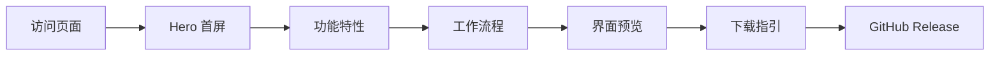

# Mimodex 项目介绍页 - 产品需求文档

## 1. 产品概述

为 Mimodex 项目创建一个精美的单页介绍网站，托管于 GitHub Pages，用于向潜在用户展示项目功能、特性和下载入口。

- 目标用户：开发者、技术爱好者、潜在测试用户
- 核心价值：通过视觉化展示降低理解成本，提供清晰的下载指引

## 2. 核心功能

### 2.1 页面模块

1. **Hero 首屏**：品牌展示、核心标语、CTA 按钮
2. **功能特性**：核心能力四宫格展示
3. **工作流程**：7步工作流可视化
4. **模型路线图**：Now / Next / Future 三阶段展示
5. **界面预览**：真实界面截图展示
6. **下载指引**：版本信息、下载按钮、系统要求
7. **页脚**：GitHub 链接、版权信息

### 2.2 页面详情

| 页面 | 模块 | 功能描述 |
|------|------|----------|
| 单页 | Hero | 全屏深色背景，品牌 Logo、主标语、副标题、双 CTA 按钮（下载/了解更多） |
| 单页 | 功能特性 | 4 个功能卡片，带图标和描述，使用 docs/images/核心功能四宫格图.png |
| 单页 | 工作流程 | 横向时间线展示 7 步工作流，使用 docs/images/工作流程图.png |
| 单页 | 模型路线 | 三列卡片展示模型支持路线图，使用 docs/images/模型路线图.png |
| 单页 | 界面预览 | 大图展示真实界面，使用 docs/images/真实界面包装图.png |
| 单页 | 下载区 | 版本号、下载按钮、SHA256、系统要求 |
| 单页 | 页脚 | GitHub 仓库链接、版权、相关文档链接 |

## 3. 核心流程

用户访问页面 → 浏览 Hero 了解项目 → 查看功能特性 → 了解工作流程 → 查看界面预览 → 点击下载 → 跳转 GitHub Release

## 4. 用户界面设计

### 4.1 设计风格

- **主色调**：深色背景 `#0a0a0a`，品牌绿 `#a3e635`（lime-400）
- **辅助色**：深灰 `#171717`，中灰 `#262626`，文字灰 `#a3a3a3`
- **按钮样式**：主按钮使用品牌绿背景+深色文字，次按钮使用透明背景+绿色边框
- **字体**：Display 字体使用 JetBrains Mono（等宽，科技感），正文使用系统字体栈
- **布局**：单页滚动，全宽区块，内容区最大宽度 1200px 居中
- **图标**：使用 Lucide React 图标库

### 4.2 页面设计概览

| 页面 | 模块 | UI 元素 |
|------|------|---------|
| 单页 | Hero | 全屏高度，深色渐变背景，居中布局，大标题+副标题+双按钮，向下滚动指示器 |
| 单页 | 功能特性 | 深色背景，4 列网格（移动端 2 列），卡片带悬停效果 |
| 单页 | 工作流程 | 深色背景，横向滚动时间线，步骤节点带序号 |
| 单页 | 模型路线 | 深色背景，3 列卡片，Now/Next/Future 标签 |
| 单页 | 界面预览 | 深色背景，大图展示，带阴影和圆角 |
| 单页 | 下载区 | 深色背景，版本信息卡片，下载按钮，系统要求列表 |
| 单页 | 页脚 | 深色背景，简洁链接列表 |

### 4.3 响应式设计

- Desktop-first 设计
- 断点：sm(640px)、md(768px)、lg(1024px)、xl(1280px)
- 移动端：Hero 文字缩小，网格变单列，时间线变垂直

### 4.4 动画效果

- 页面加载：Hero 内容淡入上移，stagger 0.1s
- 滚动触发：各区块内容随滚动淡入
- 悬停效果：卡片轻微上移+阴影增强
- 按钮悬停：背景色过渡 0.2s
