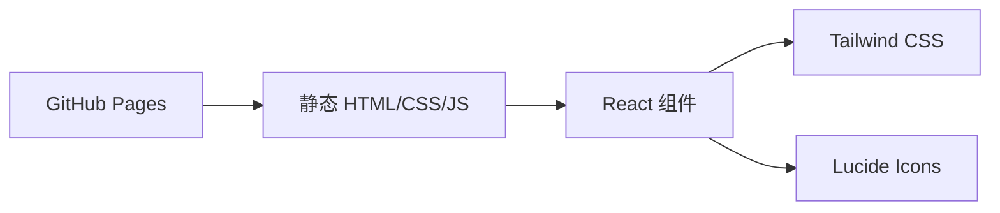

# Mimodex 项目介绍页 - 技术架构文档

## 1. 架构设计



## 2. 技术描述

- **前端**：React@18 + TypeScript + Tailwind CSS + Vite
- **初始化工具**：vite-init (react-ts 模板)
- **后端**：无（纯静态站点）
- **部署**：GitHub Pages（通过 GitHub Actions 或手动推送 gh-pages 分支）

## 3. 路由定义

| 路由 | 用途 |
|------|------|
| / | 单页介绍页（唯一页面） |

## 4. 项目结构

```
website/
├── public/
│   └── images/          # 从 docs/images 复制的图片资源
├── src/
│   ├── components/      # 可复用组件
│   │   ├── Hero.tsx
│   │   ├── Features.tsx
│   │   ├── Workflow.tsx
│   │   ├── Roadmap.tsx
│   │   ├── Preview.tsx
│   │   ├── Download.tsx
│   │   └── Footer.tsx
│   ├── App.tsx
│   ├── main.tsx
│   └── index.css
├── index.html
├── package.json
├── tsconfig.json
├── vite.config.ts
└── tailwind.config.js
```

## 5. 部署方案

### GitHub Pages 配置

1. 在仓库 Settings > Pages 中设置 Source 为 GitHub Actions
2. 创建 `.github/workflows/pages.yml` 工作流：
   - 检出代码
   - 安装 Node.js
   - 构建项目（vite build）
   - 部署到 GitHub Pages

### 图片资源处理

- 构建时将 `docs/images/` 复制到 `website/public/images/`
- 在代码中通过 `/images/xxx.png` 引用
- GitHub Pages 会自动托管 public 目录下的静态资源

## 6. 依赖列表

- react
- react-dom
- tailwindcss
- lucide-react
- vite
- typescript
