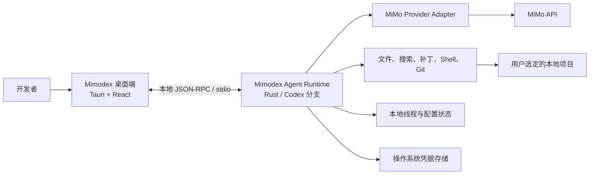
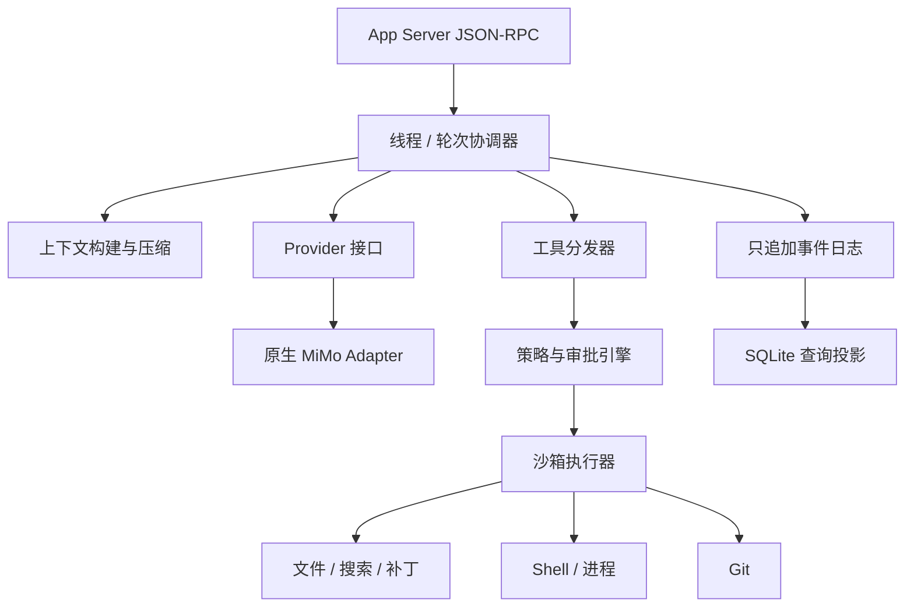

# Mimodex 架构总览

- 状态：提议方案
- 最后更新：2026-06-09
- 外部 API 基线核实日期：2026-06-09

## 1. 系统上下文

Mimodex 由桌面客户端和本地 Agent Runtime 组成。桌面客户端负责用户交互与
审阅，Runtime 负责 Provider 通信、线程状态、工具执行、权限和持久化。

## 2. 职责边界

### 桌面外壳

- 项目与线程导航；
- 输入框、流式活动、审批和错误展示；
- Diff、终端、设置与诊断界面；
- 桌面生命周期、更新和操作系统集成；
- 本地 JSON-RPC 客户端与事件投影。

桌面外壳不得自行执行模型请求的 Shell 命令，也不得成为安全策略的唯一执行者。

### Agent Runtime（运行时）

- 权威的线程、轮次、项目和事件状态；
- Prompt 构建与上下文压缩；
- MiMo API 请求和流式事件归一化；
- 工具注册、调用、取消与结果归一化；
- 沙箱和审批强制执行；
- 会话、执行记录与审计记录持久化。

### Provider Adapter（适配器）

- 将 Runtime 中立请求转换为 MiMo Chat Completions 请求；
- 归一化文本、推理、工具调用、用量、结束原因和错误；
- 保留重放所需的 Provider 专属字段；
- 仅在操作可安全重试时实施重试。

### 工具层

- 提供类型明确且输出有界的工具契约；
- 在发生副作用前强制检查根目录和执行策略；
- 产生结构化结果与可审计事件；
- 永不直接信任模型提供的路径或命令。

## 3. 逻辑组件

## 4. 标准 Agent 生命周期

1. 桌面端调用 `thread/start`，或恢复既有线程。
2. 桌面端使用用户消息和当前设置调用 `turn/start`。
3. Runtime 根据权威线程项目构建 Provider 上下文。
4. MiMo Adapter 将流式响应转换为 Runtime 标准事件。
5. 工具调用进入策略与审批引擎。
6. 已获准的工具通过沙箱执行并产生结构化结果。
7. Runtime 持续进行模型循环，直到完成、取消或失败。
8. 所有持久事件写入成功后，Runtime 才向桌面端确认完成。

## 5. 权威数据模型

### Project（项目）

- 稳定项目 ID；
- 规范化本地路径；
- 显示名称；
- Git 元数据快照；
- 信任状态与默认权限设置。

### Thread（线程）

- 稳定线程 ID；
- 项目 ID；
- Provider 与模型；
- 默认权限设置；
- 创建、更新和归档时间；
- 是否可恢复。

### Turn（轮次）

- 稳定轮次 ID；
- 用户输入；
- 实际生效的模型与策略；
- 生命周期状态；
- 用量与 Provider 请求元数据。

### Item（项目项）

轮次内有序且持久的单元：

- 用户消息；
- 助手消息；
- 助手推理内容；
- 工具调用；
- 审批决定；
- 工具结果；
- 计划更新；
- 文件变更摘要；
- 错误或取消标记。

### Event（事件）

发送给桌面端的只追加状态变化。事件具有稳定 ID 和排序字段，UI 可以安全地
重放和去重。

## 6. 存储策略

- 使用只追加的持久事件或 rollout 记录作为恢复和审计的事实来源。
- 使用 SQLite 投影提高项目、线程和活动查询速度。
- 凭据只保存在操作系统凭据存储中。
- 大型命令输出和日志采用有限保留策略，并由权威事件流引用。
- 崩溃恢复时，将执行中的工作标记为已中断。

具体存储格式要在技术验证阶段检查 Codex 分支后确定。

## 7. 安全模型

安全由两个独立控制组成：

- 沙箱强制边界：定义进程技术上能够访问什么。
- 审批策略：定义何时必须获得用户同意。

Provider 网络与 Agent 命令网络是独立能力。Runtime 可以调用配置的 MiMo 端点，
同时保持本地命令默认离线。

首版权限模式：

| 模式 | 项目文件读取 | 项目内写入 | 项目外写入 | 命令联网 |
| --- | --- | --- | --- | --- |
| 只读 | 允许 | 阻止 | 阻止 | 阻止 |
| 工作区写入 | 允许 | 允许，受保护路径除外 | 需要审批和沙箱提权 | 需要审批和沙箱提权 |
| 完全访问 | 允许 | 允许 | 明确选择模式后允许 | 明确选择模式后允许 |

## 8. 错误分类

Runtime 将失败归一化为：

- 认证失败；
- 授权或策略拒绝；
- 无效请求或协议不匹配；
- 限流；
- Provider 不可用或超时；
- 上下文超限；
- 模型工具调用格式错误；
- 工具执行失败；
- 取消；
- 持久化失败；
- Runtime 内部失败。

脱敏后的 Provider 原始错误可以附加到诊断信息，但 UI 行为必须基于归一化类别。

## 9. 可观测性

本地结构化日志应包含：

- 线程、轮次、项目、事件和 Provider 请求 ID；
- 耗时与重试元数据；
- 工具名称、状态、耗时和退出码；
- 审批类别与决定；
- 归一化错误类别。

日志默认不得包含 API 凭据，并应脱敏项目内容。私有 Beta 中的可选遥测必须
由用户明确开启，且只发送汇总后的运行事件。

## 10. 架构决策

- [ADR-0001：采用 Tauri 桌面外壳与 Rust Agent Core](decisions/ADR-0001-tauri-rust-agent-core.md)
- [ADR-0002：基于 Codex App Server 分支开发 Agent Runtime](decisions/ADR-0002-fork-codex-app-server.md)
- [ADR-0003：实现原生 MiMo Chat Completions Provider](decisions/ADR-0003-native-mimo-provider.md)
- [ADR-0004：分离沙箱强制边界与审批策略](decisions/ADR-0004-sandbox-and-approvals.md)
- [ADR-0005：在本地持久化可重放的 Agent 线程](decisions/ADR-0005-local-thread-persistence.md)
- [ADR-0006：本地只编辑源码，原生构建与 Windows 打包由 GitHub Actions 完成](decisions/ADR-0006-ci-only-native-builds.md)

## 11. 开发前验证

总体架构已原则性确认，但 Provider 边界仍以验证结果为准。开始桌面端 MVP 前，
必须完成 [MiMo Provider 技术验证清单](../validation/MIMO_PROVIDER_SPIKE.md)。

## 12. 外部能力基线

以下设计基于 2026-06-09 核实的 MiMo 官方文档：

- `mimo-v2.5-pro` 与 `mimo-v2.5` 均声明支持深度思考、流式输出和 Function Call；
- MiMo 支持 OpenAI 兼容和 Anthropic 兼容 API 格式；
- 思考模式的 Agent 对话中存在工具调用时，必须完整回传要求的历史
  `reasoning_content`，否则 API 返回 400。

参考：

- https://platform.xiaomimimo.com/docs/en-US/quick-start/model
- https://platform.xiaomimimo.com/docs/en-US/quick-start/first-api-call
- https://platform.xiaomimimo.com/docs/en-US/usage-guide/passing-back-reasoning_content
